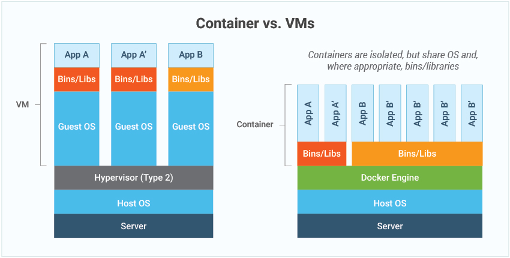
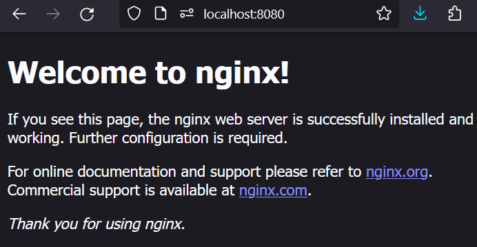

# LEARNING DOCKER

## What Is A Container

Containers are:

- **Isolated** environments.
- A **form** of operating system **virtualization**.
- Containers have all the necessary executables, binary code, libraries, and configuration files for an application.
- Containers are **lightweight and portable**.
- Containers have a **base image** that include an Ubuntu, Alpine, or other operating systems which are typically **minimal versions** optimized for containerization.

### Containers VS Virtual Machines

Virtual machines contain a full operating system and containers only contain the required files to run an app:



A container engine is like a tool that helps you run containers on your computer. It takes care of starting, stopping, and managing containers so that you can run your applications smoothly. It's what makes containers work, allowing you to package and run your software in a neat and efficient way. Popular container engines include Docker and containerd.

| Characteristics | Container                                                                                             | Virtual machine                                                                       |
|-----------------|-------------------------------------------------------------------------------------------------------|---------------------------------------------------------------------------------------|
| Definition      | Software code package containing an application’s code, its libraries, and other dependencies that make up the application running environment. | Digital replica of a physical machine. Partitions the physical hardware into multiple environments. |
| Virtualization | Virtualizes the operating system.                                                                    | Virtualizes the underlying physical infrastructure.                                     |
| Encapsulation  | Software layer above the operating system required for running the application or application component. | Operating system, all software layers above it, multiple applications.                  |
| Technology     | Container engine coordinates with the underlying operating system for resources.                     | Hypervisor coordinates with underlying operating system or hardware.                    |
| Size           | Lighter weight (think in terms of MB).                                                              | Much larger (think in terms of GB).                                                    |
| Control        | Less control of the environment outside the container.                                               | More control over the entire environment.                                              |
| Flexibility    | More flexible. You can quickly migrate between on-premises and cloud-centered environments.          | Less flexible. Migration has challenges.                                               |
| Scalability    | Highly scalable. Granular scalability possible with microservices.                                    | Scaling can be costly. Requires switching from on-premises to cloud instances for cost-effective scale. |

Read more at: https://aws.amazon.com/compare/the-difference-between-containers-and-virtual-machines/

## Images

An container image is a file with instructions to create a container, so it is a template and a container is the running instance of that template.

Images contains application code, libraries, tools, dependencies, commands to execute, and other files needed to make an application run.

### DockerHub

Docker Hub is an image repository: https://hub.docker.com/

Basically is where people share images.

## What Is Docker

The word "Docker" has different meanings:

- It is the name of a company, Docker.
- Docker (the company) has a platform, the Docker platform, which includes Docker Engine, Docker CLI (command-line interface), Docker Compose (a tool for defining and running multi-container Docker applications), and other associated tools.
- Command-Line Tool: The `docker` command-line tool is a central component of the Docker platform.
- Container Images: The term "Docker" is often used colloquially to refer to Docker images.

## Download Docker

Download and install docker from https://www.docker.com/products/docker-desktop/


### Verify Docker Is Installed

Use `--version` to see if docker was installed:

```shell
$ docker --version
Docker version 24.0.7, build afdd53b
```

## Start The Daemon

Depending on your system you may need to use one of these commands:

- `sudo systemctl start docker`: This command uses the systemd service management system, which is common in modern Linux distributions such as Ubuntu from version 15.04 onwards, CentOS 7, Fedora, among others. Systemd is an initialization and service management system that replaces older tools like SysVinit. systemctl is the command used to interact with systemd, and start docker instructs systemd to start the Docker service.
- `sudo service docker start`: This command is older and is common in distributions that still use the SysVinit initialization system, such as some older versions of Ubuntu (prior to 15.04) and Debian. service is a script that allows starting, stopping, and managing system services.
    - Output example:
        ```
        $ sudo service docker start
        * Starting Docker: docker
        ```
    - Check if it is running:
        ```
        $ sudo service docker status
        * Docker is running
        ```
See more at: https://docs.docker.com/config/daemon/start/

Just for your knowledge: A **service management system** (in the context of Linux operating systems) is a software component responsible for controlling and supervising the execution of services or daemons on a system. These services can include anything from network services like SSH or HTTP servers to system-level services like logging or time synchronization.

## Hello World

There is an image called hello-world in the docker hub: https://hub.docker.com/_/hello-world

Let's create an image by typing `docker container run hello-world` in the command line:

```
$ docker container run hello-world
Unable to find image 'hello-world:latest' locally
latest: Pulling from library/hello-world
c1ec31eb5944: Pull complete
Digest: sha256:d000bc569937abbe195e20322a0bde6b2922d815332fd6d8a68b19f524b7d21d
Status: Downloaded newer image for hello-world:latest

Hello from Docker!
This message shows that your installation appears to be working correctly.

To generate this message, Docker took the following steps:
 1. The Docker client contacted the Docker daemon.
 2. The Docker daemon pulled the "hello-world" image from the Docker Hub.
    (amd64)
 3. The Docker daemon created a new container from that image which runs the
    executable that produces the output you are currently reading.
 4. The Docker daemon streamed that output to the Docker client, which sent it
    to your terminal.

To try something more ambitious, you can run an Ubuntu container with:
 $ docker run -it ubuntu bash

Share images, automate workflows, and more with a free Docker ID:
 https://hub.docker.com/

For more examples and ideas, visit:
 https://docs.docker.com/get-started/

```

You can read "Unable to find image" on the second line, that means that the image was not found locally in your computer so it will ask docker hub for the image.

You can use the following command to see the images that are present locally in your computer:

```
$ docker images
REPOSITORY                                TAG       IMAGE ID       CREATED         SIZE
hello-world                               latest    d2c94e258dcb   9 months ago    13.3kB
```

## See Containers

Use the `docker ps -a` to see the containers:

```
$ docker ps -a
CONTAINER ID   IMAGE         COMMAND    CREATED          STATUS                      PORTS     NAMES
08788d9f577b   hello-world   "/hello"   10 minutes ago   Exited (0) 10 minutes ago             nostalgic_sinoussi
```

`-a` option shows both running and exited containers.

> `docker container ls -a` will return the same output

### Remove an exited container

You just need to provide enough numbers of the container id to this command:

```
$ docker container rm 087
087
```

> You can also select multiple containers to rm just by adding a space between the ids.

If you have more containers that start with the same numbers then you will need to provide enough numbers no make the search unique.

You can remove all stopped/exited containers using:

```
docker container prune
```

### Remove an image

```
$ docker images
REPOSITORY                                TAG       IMAGE ID       CREATED         SIZE
hello-world                               latest    d2c94e258dcb   9 months ago    13.3kB

$ docker image rm hello-world:latest
Untagged: hello-world:latest
Untagged: hello-world@sha256:d000bc569937abbe195e20322a0bde6b2922d805332fd6d8a68b19f524b7d21d
Deleted: sha256:d2c94e258dcb3c5ac2798d32e1249e42ef01cba4841c2234249495f87264ac5a
Deleted: sha256:ac28800ec8bb38d5c35b49d45a6ac4777544941199075dff8c4eb63e093aa81e

$ docker images
REPOSITORY                                TAG       IMAGE ID       CREATED         SIZE
```

> Note: you don't need to remove container images if you are going to create more containers in the future. Keeping the images locally will speeds the time to launch a new container.

## Run Ubuntu In Interactive Mode

```
$ docker container run -it ubuntu bash

Unable to find image 'ubuntu:latest' locally
latest: Pulling from library/ubuntu
01007420e9b0: Already exists
Digest: sha256:f9d633ff6640178c2d0525017174a688e2c1aef28f0a0130b26bd5554491f0da
Status: Downloaded newer image for ubuntu:latest
root@0a846f871e56:/# 
root@0a846f871e56:/# echo "I'm inside the container B)"
I'm inside the container B)
root@0a846f871e56:/#
```

the `-it` flag is used to allocate a pseudo-TTY (terminal) and keep the stdin (standard input) open even if not attached. Here's what each part means:

- `-i` stands for interactive. It keeps STDIN open even if not attached. This allows you to interact with the command running inside the container.
    - "attached" refers to the act of connecting your local terminal to the standard input (stdin), standard output (stdout), and standard error (stderr) streams of a running container. So `-i` means keep the stdin of the container even if is not connected to my local terminal.
    - The `-i` option works without the `-t` option but not the other way around. `-t` attach a pseudo-tty but still need the stdin to be open.
- `-t` stands for allocate a pseudo-TTY. This simulates a terminal, allowing you to interact with the shell (bash in this case) as if you were directly connected to it.
    - `-t` option attaches the pseudo-tty to your local terminal.

> Without an interactive shell (or a program that keeps the container running a process), the container will exit immediately because there;s nothing making the container work.

The `bash` command instructs the container to run the bash command.

Note: If you didn't add a command at the end when creating a new container, Docker will use the default command specified in the Docker image.

The ubuntu image executes bash as the default command:

```
 docker image inspect ubuntu:latest | jq .[0].ContainerConfig.Cmd
[
  "/bin/sh",
  "-c",
  "#(nop) ",
  "CMD [\"/bin/bash\"]"  <-- See here
]
```

So just for this example you can obtain the same result either if you add bash at the end of the command or not.

Exit the container by pressing Ctrl+D, then inspect all the containers:

```
$ docker ps -a
CONTAINER ID   IMAGE     COMMAND       CREATED         STATUS                       PORTS     NAMES
f7b052570af7   ubuntu    "/bin/bash"   9 minutes ago   Exited (130) 6 minutes ago             happy_tu
```

Since we did not manually named the container docker use a random name, happy_tu.
Docker also created a container ID. You can see the container is in exited status, and also the command /bin/bash because that what we specified.

## BusyBox

BusyBox combines tiny versions of many common UNIX utilities into a single small executable. It provides replacements for most of the utilities you usually find in GNU fileutils, shellutils, etc. The utilities in BusyBox generally have fewer options than their full-featured GNU cousins; however, the options that are included provide the expected functionality and behave very much like their GNU counterparts. BusyBox provides a fairly complete environment for any small or embedded system.

Read more at: https://hub.docker.com/_/busybox

### Create a busybox container

```
$ docker run -it --rm busybox
Unable to find image 'busybox:latest' locally
latest: Pulling from library/busybox
9ad63333ebc9: Pull complete
Digest: sha256:6d9ac9237a84afe1516540f40a0fafdc86859b2141954b4d643af7066d598b74
Status: Downloaded newer image for busybox:latest
/ # echo "hello from my busybox container"
hello from my busybox container
/ # 
```

> Note: Using the `--rm` option ensures that the container is automatically removed once it stops running. 

### Compare size with ubuntu

```
$ docker images
REPOSITORY       TAG       IMAGE ID       CREATED         SIZE
ubuntu           latest    3db8720ecbf5   12 days ago     77.9MB
busybox          latest    3f57d9401f8d   5 weeks ago     4.26MB
```

The busybox image is only 4.26MB!

**Remember**: Busybox is not a full-featured Linux OS, it is just a set of Linux utils, you can prove this by trying to run `cat /etc/os-release` on a busybox container, the result will be `no such file or directory`.

## Alpine

Alpine is an image based in busybox. Read more at https://hub.docker.com/_/alpine

Executables in Alpine are actually links to busybox utilities:

```
ALPINE/ # ls -l bin/
total 792
lrwxrwxrwx    1 root     root            12 Jan 26 17:53 arch -> /bin/busybox
lrwxrwxrwx    1 root     root            12 Jan 26 17:53 ash -> /bin/busybox
lrwxrwxrwx    1 root     root            12 Jan 26 17:53 base64 -> /bin/busybox
lrwxrwxrwx    1 root     root            12 Jan 26 17:53 bbconfig -> /bin/busybox
-rwxr-xr-x    1 root     root        808712 Nov  7 18:53 busybox     ATTENTION HERE
lrwxrwxrwx    1 root     root            12 Jan 26 17:53 cat -> /bin/busybox
lrwxrwxrwx    1 root     root            12 Jan 26 17:53 chattr -> /bin/busybox
--more lines...--
```

With this you can confirm Alpine is based in busybox and busybox is just a set of utilities:

```
ALPINE/ # ls -l /bin/ping
lrwxrwxrwx    1 root     root            12 Jan 26 17:53 /bin/ping -> /bin/busybox
ALPINE/ #
ALPINE/ # busybox ping -c 4 google.com
PING google.com (142.251.34.14): 56 data bytes
64 bytes from 142.251.34.14: seq=0 ttl=53 time=31.510 ms
64 bytes from 142.251.34.14: seq=1 ttl=53 time=11.768 ms
64 bytes from 142.251.34.14: seq=2 ttl=53 time=14.854 ms
64 bytes from 142.251.34.14: seq=3 ttl=53 time=14.797 ms

--- google.com ping statistics ---
4 packets transmitted, 4 packets received, 0% packet loss
round-trip min/avg/max = 11.768/18.232/31.510 ms
ALPINE/ #
```

You can find more links and commands at `/sbin`, you can find `/sbin/apk` command which is useful to install packages inside the Alpine container, this command is not present in the busybox container:

```
BUSYBOX/ # apk --version
sh: apk: not found
BUSYBOX/ #
```

```
ALPINE/ # apk --version
apk-tools 2.14.0, compiled for x86_64.
ALPINE/ #
```

### Stopping A Container

The `docker container stop <contianer_id>` is used to stop a container, when you issue this command against an **alpine** container docker sends a signal called `SIGTERM` but `sh` does NOT react to it and in 10 seconds docker fallbacks to `docker container kill` that sends a `SIGKILL` to the container. Other containers like NGINX work with `docker container stop <container_id>` without problems.

Also when you are in the shell terminal of an **alpine** container it also does not respond to `Ctrl+C`, in this case a `SIGINT` is sent but sh does not accept such commands, the workaround is to use `exit` command or use `docker container stop <container_id>`.

## NGINX

Nginx (pronounced "engine-x") is an open source reverse proxy server for HTTP, HTTPS, SMTP, POP3, and IMAP protocols, as well as a load balancer, HTTP cache, and a web server (origin server).

Read more at: https://hub.docker.com/_/nginx

### Pull NGINX Image

`docker pull nginx`

Note: when you are downloading a docker image it is very likely to see an output similar to this one:

```
$ docker pull nginx
Using default tag: latest
latest: Pulling from library/nginx
c499e6d25d6: Pulling fs layer
- more lines... -
```

The `fs` in `Pulling fs layer` means `file system`

### Explore The Image

```
$ docker images
REPOSITORY                                TAG       IMAGE ID       CREATED         SIZE
nginx                                     latest    e4720093a3c1   12 days ago     187MB
```

You can see the NGINX image is heavier than the other images we already saw.

### Create A NGINX Container

```
$ docker run nginx
- no output -
```

This time the container did NOT show any output but we can see that we are still inside the container because we are not seeing the host prompt.

We can confirm this by opening a new terminal a checking the containers:

```
$ docker ps
CONTAINER ID   IMAGE   COMMAND                  CREATED         STATUS         PORTS    NAMES
2bc75d28aaab   nginx   "/docker-entrypoint.…"   5 minutes ago   Up 5 minutes   80/tcp   zen_benz
```

You can confirm the NGINX container is still up.

## Port Mapping

A we sa in the NGINX section, the NGINX container had an open port 80/tcp:

```
$ docker ps
CONTAINER ID   IMAGE   COMMAND                  CREATED         STATUS         PORTS    NAMES
2bc75d28aaab   nginx   "/docker-entrypoint.…"   5 minutes ago   Up 5 minutes   80/tcp   zen_benz
```

If we want to access that port using the web browser we can go to localhost:80

Unfortunately this won't work, and that is because the NGINX container does not have a mapped port with the host OS.

Let's create a new NGINX container and map one port in the host to the container:

`$ docker run --rm -p 8080:80 --name myMappedNginx nginx`

`-p` option is used to create the port mapping, the first number represents the port in the host and the second number after the colon `:` is the port in the container.

Now let's open localhost:8080 (this time we use 8080 because that's the connection we have from the host to the container.):



### Custom NGINX 

We are going to use a custom hmtl file to launch nginx this time: [index.html](./containers/nginx/index.html)

Create a volume:

```
$ docker container run -p 8081:80 --rm -v "$(pwd)"/containers/nginx:/usr/share/nginx/html nginx
```

> You can use command substitution `$(pwd)` or you can use the environmental variable `$PWD`.

> Remember to change `"$(pwd)"/containers/nginx` with YOUR absolute path if you are not using the current directory.

> A volume is a way to persist data generated by and used by Docker containers. It's a mechanism that allows data to exist beyond the lifetime of a single container. Volumes are used to share data between containers, or between the host machine and containers.

Access `localhost:8081` in your browser:


You can update the content in the index.html file in the host and refresh the browser.

## Detached Mode

You can run containers in the background by using the `-d` (detached) option:

```
docker container run --rm -p 8081:80 -d nginx
d62d9a5621f420eca502b5beb15ed3dff50fd21c90d2723daf8a1c985a88b5a2
```

You can see the container id is shown right after pressing enter.

You can access the logs of the container using this command:

```
docker container logs <container_id>
```

You can stop the container using:

```
docker container stop <container_id>
```

## Playing With An Ubuntu Container

1. The hostname is actually the container id:

```
$ docker container run --rm -it --name ubun1 ubuntu bash
root@226c2bdb5278:/# hostname
226c2bdb5278
```

Confirm this by opening another terminal tab:

```
$ docker ps
CONTAINER ID   IMAGE     COMMAND   CREATED          STATUS          PORTS     NAMES
226c2bdb5278   ubuntu    "bash"    24 seconds ago   Up 23 seconds             ubun1
```

2. Use `hostname -i` to see the ip address:

```
root@226c2bdb5278:/# hostname -i
172.17.0.2
root@226c2bdb5278:/#
```

3. The IP address is actually part of the bridge network created by docker, confirm this by creating a second ubuntu container (do not stop the first one):

```
$ docker container run --rm -it --name ubun2 ubuntu bash   <- Second container
root@41d33075f063:/# hostname -i
172.17.0.3
root@41d33075f063:/#
```

Now let's ping the first container:

```
# Let's first install ping on the second container:
root@41d33075f063:/# apt-get update
root@41d33075f063:/# apt-get install iputils-ping

# Now let's ping the first container:
root@41d33075f063:/# ping -c4 172.17.0.2
PING 172.17.0.2 (172.17.0.2) 56(84) bytes of data.
64 bytes from 172.17.0.2: icmp_seq=1 ttl=64 time=0.170 ms
64 bytes from 172.17.0.2: icmp_seq=2 ttl=64 time=0.113 ms
64 bytes from 172.17.0.2: icmp_seq=3 ttl=64 time=0.104 ms
64 bytes from 172.17.0.2: icmp_seq=4 ttl=64 time=0.114 ms

--- 172.17.0.2 ping statistics ---
4 packets transmitted, 4 received, 0% packet loss, time 3135ms
rtt min/avg/max/mdev = 0.104/0.125/0.170/0.026 ms
root@41d33075f063:/#
```


## Python Containers

https://hub.docker.com/_/python

Let's start by pulling the latest image:

```
docker container run --rm -it --name mypy python
```

> If you don't want to create a container you can just pull the image `docker container pull python`

Once the above command is executed you will see the python interpreter:

```
$ docker container run --rm -it --name mypy python
Python 3.12.2 (main, Feb 13 2024, 09:17:46) [GCC 12.2.0] on linux
Type "help", "copyright", "credits" or "license" for more information.
>>> print("HELLO PYTHON WORLD :D")
HELLO PYTHON WORLD :D
>>>
```

You can see the default command for the Python image was `python3`:

```
$ docker ps
CONTAINER ID   IMAGE     COMMAND     CREATED          STATUS          PORTS     NAMES
107a47ca7f97   python    "python3"   36 seconds ago   Up 35 seconds             mypy
```

> You can also see this by inspecting the image: `$ docker image inspect python:latest`

### Run a single Python script

```
$ docker container run -it --rm -v "$PWD":/usr/src/myapp -w /usr/src/myapp python python app.py
Enter the height of the Christmas tree: 6 
     *
    ***
   *****
  *******
 *********
***********
     |
```
- The `-w` option in the command specifies the working directory inside the container. You can omit this option if you specify the path in the command: `python /usr/src/myapp/app.py`.
- After the name of the image you can specify the command to run, that's why you see `python app.py` at the end.

> `app.py` can be found at [app.py](./containers/python/app.py)